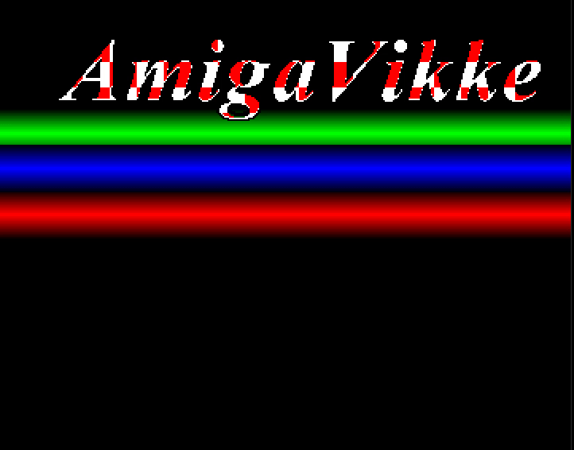

# Amiga-C-Examples
A collection of Amiga C source code, compile and debug with the Bartman-Abyss VSCode extension.
The collection includes C conversions of the AmigaVikke & Reaktor.com examples along with several other examples.
